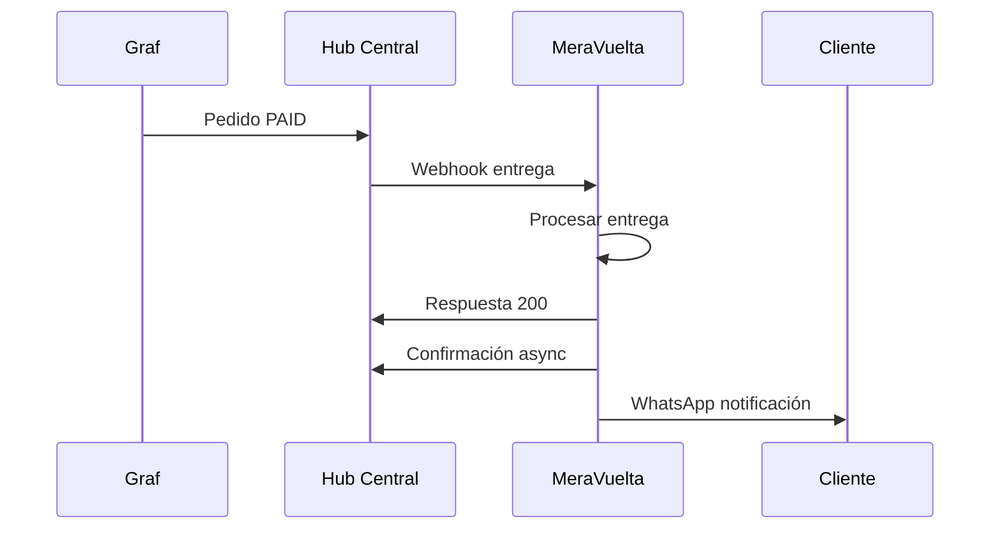

# MeraVuelta - Integración con Hub Central

## Implementación de Webhook para Entregas

Este documento describe la implementación del sistema de webhooks de MeraVuelta para la integración con el Hub Central del ecosistema Humanizar.

### 🎯 Propósito

MeraVuelta recibe webhooks del Hub Central cuando se completan pedidos en Graf, convirtiendo automáticamente los pedidos pagados en entregas para gestión logística.

### 🏗️ Arquitectura

```
Graf → Hub Central → MeraVuelta
                ↓
        Notificación Entrega + WhatsApp
```

### 📡 Endpoint Principal

**POST** `/api/webhooks/deliveries`

#### Headers Requeridos
- `Content-Type: application/json`
- `x-hub-signature-256: sha256=<firma_hmac>`

#### Payload Estructura
```json
{
  "orderId": "graf-order-123",
  "orderNumber": "2024001",
  "status": "PAID",
  "customerName": "María García",
  "customerPhone": "573001234567",
  "customerEmail": "maria@email.com",
  "customerDocument": "12345678",
  "customerDocumentType": "CC",
  "deliveryAddress": "Calle 123 #45-67",
  "city": "Bogotá",
  "department": "Cundinamarca",
  "orderValue": 85000,
  "paymentMethod": "CREDIT_CARD",
  "products": [
    {
      "name": "Café Premium 500g",
      "quantity": 2,
      "unitPrice": 25000,
      "totalPrice": 50000
    }
  ],
  "deliveryNotes": "Entregar en portería",
  "timestamp": "2024-01-15T10:30:00Z"
}
```

### 🔐 Seguridad

- **Validación HMAC-SHA256**: Todas las solicitudes deben incluir firma válida
- **Secret**: `meravuelta-webhook-secret-2024`
- **Sin autenticación adicional**: La seguridad se basa en la firma HMAC

### 🚀 Funcionalidades

#### 1. Creación de Entregas
- Convierte pedidos de Graf en entregas de MeraVuelta
- Genera número único de entrega automáticamente
- Estado inicial: "Compra"

#### 2. Gestión de Clientes
- Busca cliente existente por teléfono
- Crea nuevo cliente si no existe
- Asigna empresa Graf como propietaria

#### 3. Notificaciones
- Envío automático de WhatsApp al cliente
- Confirmación asíncrona al Hub Central

#### 4. Manejo de Duplicados
- Detecta pedidos duplicados por número de orden
- Retorna información de entrega existente

### 📊 Respuestas

#### Éxito (200)
```json
{
  "success": true,
  "message": "Webhook procesado correctamente",
  "deliveryNumber": 123456789,
  "status": "Compra"
}
```

#### Error Firma Inválida (401)
```json
{
  "error": "Unauthorized",
  "message": "Firma de webhook inválida"
}
```

#### Error Validación (400)
```json
{
  "error": "Bad Request",
  "message": "Validation error"
}
```

### 🧪 Testing

Se incluyen 8 tests de integración completos:

1. **Health Check** - Verificación estado del servicio
2. **Webhook Válido** - Creación exitosa de entrega
3. **Firma Inválida** - Rechazo por seguridad
4. **Pedido Duplicado** - Manejo de duplicados
5. **Datos Faltantes** - Validación de campos requeridos
6. **Sin Firma** - Rechazo sin autenticación
7. **Productos Múltiples** - Procesamiento completo
8. **Datos Mínimos** - Cliente con información básica

### 🏃‍♂️ Ejecución de Tests

```bash
# Instalar dependencias
npm install

# Ejecutar tests
npm test

# Con cobertura
npm run coverage

# Solo tests de webhook
npm test -- webhook-integration.test.js
```

### 🔧 Configuración

#### Variables de Entorno
```bash
# MeraVuelta
PORT=3006
WEBHOOK_SECRET=meravuelta-webhook-secret-2024

# Hub Central (para confirmaciones)
HUB_CENTRAL_URL=http://localhost:3007

# Base de datos
DB_HOST=localhost
DB_PORT=5432
DB_NAME=meravuelta
DB_USER=postgres
DB_PWD=postgres
```

#### Archivos Principales
- `src/controllers/webhookController.ts` - Control de webhooks
- `src/services/deliveryService.ts` - Lógica de entregas
- `src/services/webhookService.ts` - Validación y confirmaciones
- `src/modules/HubCentralWebhooks/index.ts` - Rutas de webhook
- `tests/webhook-integration.test.js` - Tests de integración

### 🔄 Flujo de Confirmación Asíncrona



### 📋 Checklist de Implementación

- ✅ Endpoint webhook POST /api/webhooks/deliveries
- ✅ Validación HMAC-SHA256
- ✅ Servicio de creación de entregas
- ✅ Integración con sistema de clientes existente
- ✅ Notificaciones WhatsApp
- ✅ Confirmaciones asíncronas al Hub Central
- ✅ Manejo de errores y duplicados
- ✅ Tests de integración completos (8 casos)
- ✅ Documentación técnica
- ✅ Health check endpoint

### 🎉 Estado: COMPLETADO

La integración de MeraVuelta con el Hub Central está lista para producción con todas las funcionalidades implementadas y probadas.

### 📞 Endpoints Adicionales

#### Health Check
**GET** `/api/webhooks/health`

Respuesta:
```json
{
  "status": "ok",
  "service": "MeraVuelta Delivery Service",
  "timestamp": "2024-01-15T10:30:00Z",
  "database": "connected"
}
```
